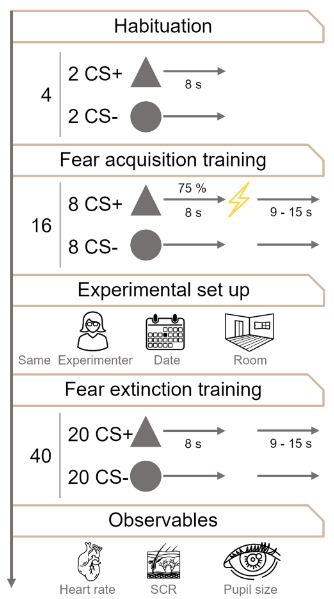

# CALINET Converter



A modular Python pipeline for converting lab-specific CALINET fear-conditioning datasets into a harmonized, BIDS-style dataset structure. The converter standardizes physiology, events, eyetracking, questionnaire/phenotype data, metadata, anonymization, trimming, and QA outputs across labs while preserving lab-specific import logic where needed.

This README documents the end-to-end workflow implemented by the current codebase, including installation, command-line usage, per-modality processing, metadata handling, trimming, logging, anonymization, and expected outputs.

---

## What this project does

At a high level, the converter:

1. scans a raw dataset directory for subject folders
2. loads participant and phenotype/questionnaire data
3. creates dataset-level descriptor files
4. processes each subject's physiology and events
5. optionally processes eyetracking / pupillometry if available for that lab
6. trims recordings to a standardized analysis window
7. aggregates phenotype and shock-rating outputs across subjects
8. anonymizes subject identifiers in the converted dataset
9. generates QA plots for each subject

The dataset-level orchestration is handled by `convert_data(...)`, which processes subject folders discovered with `find_sub_dirs(...)`, writes dataset descriptors, aggregates phenotypes, runs subject-level conversion, anonymizes the finished dataset, and then generates QA figures. The pipeline supports both serial and multiprocessing execution. 

---

## Repository structure

The current implementation is split across several modules, each responsible for a specific part of the conversion pipeline:

- `dataset.py`
  - dataset-level orchestration
  - subject scheduling
  - aggregated phenotype handling
  - anonymization
  - QA plot generation
- `physio.py`
  - raw physiology loading
  - session splitting into acquisition/extinction
  - modality-wise writing
  - physiology metadata generation
- `pupil.py`
  - eyetracking file discovery
  - EDF/ASC/TXT handling
  - pupil-size conversion to mm
  - gaze coordinate conversion to mm
  - physioevents generation
- `metadata.py`
  - dataset description generation
  - HED mapping
  - participant metadata cleanup and harmonization
- `pheno.py`
  - participant/questionnaire loading
  - phenotype aggregation
  - questionnaire specification JSON generation
- `anonymize.py`
  - subject-ID remapping and renaming of files/directories
- `io.py`
  - JSON I/O
  - TSV/TSV.GZ reading and writing
  - helper functions for sidecars and compression
- `plotting.py`
  - QA plotting utilities for physiology and eyetracking outputs
- `utils.py`
  - filesystem helpers
  - log merging/cleanup
  - timestamp creation
  - subject discovery and related helpers

---

## Installation

### 1. Clone the repository
```bash
git clone https://github.com/gjheij/calinet-main
cd calinet-main
```

### 2. Create and activate the Conda environment
```bash
conda env create -f environment.yml
conda activate pspm_env
```

### 3. Install the package (editable mode)
```bash
pip install -e .
```

### 4. Verify external tools for eyetracking

If you process EyeLink EDF files, make sure the external conversion workflow used by `convert_all_edfs_to_asc(...)` is available on the system. The eyetracking pipeline assumes raw EyeLink EDF files can be converted to ASC before parsing.

---

## Command-line entry point

The command-line wrapper accepts the following arguments:

```bash
python -m calinet.convert `
    --input-dir /path/to/sourcedata/lab `
    --output-dir /path/to/converted/lab `
    --n-workers 4 `
    --clean `
    --debug
```

### Arguments

#### `--input-dir`
Path to the raw source dataset for a single lab.

Example:

```bash
--input-dir Z:\CALINET2\sourcedata\bielefeld
```

This directory must exist. The converter expects to find subject folders and lab-specific raw data inside it.

#### `--output-dir`
Destination directory for the converted dataset.

Example:

```bash
--output-dir Z:\CALINET2\converted\bielefeld
```

If omitted, the script attempts to derive the output directory automatically by replacing `sourcedata` with `converted` in `--input-dir`.

#### `--clean`
If set, the converter is allowed to reuse an existing output directory and clean it before processing.

Without `--clean`, the script refuses to continue if the output directory already exists and is not empty.

#### `--debug`
Enables debug-level logging. This is useful for troubleshooting file discovery, metadata inference, trimming, and modality-specific processing.

#### `--n-workers`
Number of parallel worker processes used for subject-level conversion and QA generation.

- `1` = serial execution
- `>1` = multiprocessing using `ProcessPoolExecutor`

---

## Expected input organization

The pipeline is built around CALINET lab datasets with subject folders named like:

```text
sub-001
sub-002
sub-003
```

Subject discovery is performed with `find_sub_dirs(...)`, which traverses the input tree and keeps subject directories while skipping paths containing terms like `exclude`, `shock`, or `processed`.

The dataset name is inferred from the basename of `input_dir`. That inferred lab name is then used to retrieve lab-specific settings from `available_labs`.

---

## End-to-end processing workflow

## 1. Dataset initialization

At the beginning of `convert_data(...)`, the converter:

- infers the dataset / lab name from `input_dir`
- optionally cleans the output directory
- creates dataset-level descriptor files
- loads participant and phenotype data
- discovers all subject folders
- creates a common `phenotype/` directory in the output tree

### Dataset-level descriptor files

`create_dataset_descriptors(...)` creates:

- `dataset_description.json`
- `README`
- `.bidsignore`

The `.bidsignore` file excludes generated or non-BIDS paths such as:

- `phenotype/`
- `log.log`
- `physio/`
- `mapper.json`
- `derivatives/`

---

## 2. Participant and phenotype aggregation

Participant/phenotype loading is performed by `handle_participant_info(...)`, which calls `gather_all_participant_pheno(...)`.

### Participant loading

The phenotype pipeline:

- loads a lab-specific questionnaire file
- parses participant data using a lab-specific parser
- normalizes participant metadata
- writes participant metadata JSON when configured to do so

### Participants metadata cleanup

`map_participants_tsv(...)` standardizes participant sex coding by:

- renaming `gender` to `sex`
- mapping values like `male`, `female`, `m`, `f`, `1`, `2`, etc.
- converting missing values to `n/a`
- updating an accompanying JSON sidecar when present

### Questionnaire aggregation

`handle_pheno(...)` creates aggregated questionnaire outputs in the dataset-level `phenotype/` directory. It runs lab-specific aggregation functions such as:

- `aggr_bfi_data`
- `aggr_gad_data`
- `aggr_ius_data`
- `aggr_phq_data`
- `aggr_soc_data`
- `aggr_stai_data`

For each successfully aggregated measure, it also creates a JSON questionnaire specification with reverse-scoring metadata.

### Reverse-scored item handling

`create_spec_json_aggregated(...)` detects reverse-coded items from column suffixes such as:

- `_r`
- `_rev`

It then:

- rewrites the TSV with canonical item names
- marks corresponding items in the JSON metadata as `ReverseScored`
- optionally respects `items_already_corrected=True` in lab metadata

---

## 3. Subject-level processing

Each subject is processed through `_process_single_subject(...)`. This function exists at module scope so it can be used safely with Windows multiprocessing.

For each subject, the pipeline runs:

1. `handle_physio(...)`
2. `handle_events(...)`
3. `handle_eyetracking(...)`
4. `run_pspm_trim_directory(...)`

The return value includes the subject identifier and task ratings used for later shock-rating aggregation.

---

## Physiology processing

## Overview

`handle_physio(...)` is responsible for:

- locating the subject's raw physiology file using a lab-specific module
- reading the raw physiology data
- splitting the recording into task sessions
- writing modality-specific outputs for each session

The lab-specific module is expected to provide at least:

- `find_physio_acq_file(...)`
- `read_raw_physio_file(...)`

### Session splitting

The raw physiology recording is split into sessions, usually:

- `acquisition`
- `extinction`

This happens via `split_df_into_sessions(...)`, which:

1. extracts event onsets from a TTL-like signal using `extract_onsets_from_ttl(...)`
2. calls `split_onsets(...)` to identify the large gap separating sessions
3. computes a split index from sampling rate and split time
4. slices the dataframe into session-specific segments

### Gap detection between acquisition and extinction

`split_onsets(...)` determines the split point based on unusually large temporal gaps between event onsets. The threshold depends on the mean event spacing and a lab-specific or default gap factor.

The implementation is designed for the common CALINET pattern in which acquisition and extinction occur in a single continuous physiology recording separated by a long pause.

---

## Per-modality physiology handling

After session splitting, `split_and_write_output_files(...)` iterates through the modalities listed in `available_labs[lab_name]["Modalities"]`. For each task and modality, it calls `handle_modality(...)`.

Supported physiology modalities in the codebase include:

- `scr`
- `ecg`
- `resp`
- `ppg`

### Common physiology output pattern

For each modality/task combination, the converter writes:

- `sub-XXX_task-acquisition_recording-scr_physio.tsv.gz`
- `sub-XXX_task-acquisition_recording-scr_physio.json`

and corresponding `task-extinction` files.

### SCR
SCR metadata are built from a template and then enriched through `fill_scr_json(...)`. The resulting JSON sidecar typically contains:

- channel information
- units
- sampling frequency
- modality-specific metadata fields

### ECG
ECG output uses `ECG_JSON_CONTENT` plus lab/channel metadata merged through `fill_ecg_json(...)`.

### RESP
RESP output uses `RESP_JSON_CONTENT` and modality-specific filling via `fill_resp_json(...)`.

### PPG
PPG output uses `PPG_JSON_CONTENT` and modality-specific filling via `fill_ppg_json(...)`.

### Timestamp handling
If a `timestamp` column is missing, helper code can generate one using `ensure_timestamp(...)`, which:

- validates the existing timestamp if present
- otherwise inserts a new `timestamp` column from sampling rate
- returns whether the dataframe was modified

---

## Physiology file format details

The low-level I/O layer in `io.py` uses:

- `read_physio_tsv_headerless(...)`
- `write_physio_tsv_gz_headerless(...)`

### Reading
Physiology TSV files are typically read as:

- tab-separated
- headerless
- compressed or uncompressed (`.tsv` or `.tsv.gz`)

When the corresponding JSON sidecar contains a `Columns` field, those names are assigned to the dataframe columns automatically.

### Writing
`write_physio_tsv_gz_headerless(...)` writes compressed physiology files with:

- headerless TSV content
- `na_rep="n/a"`
- reproducible gzip settings (`mtime=0`)
- an empty filename in the gzip header

This is useful for deterministic output generation.

---

## Event processing

After physiology conversion, `_process_single_subject(...)` calls `handle_events(...)`.

Although the full event implementation is not shown here, the surrounding code makes clear that the event stage is responsible for:

- creating task-specific `*_events.tsv` files
- generating `*_events.json` metadata
- aligning event information with physiology-derived onsets
- extracting task ratings for later aggregation
- additional events such as `USo` (US-omission during `CSpu`), `USm` (US-omission during `CSm`), and `USp` (presented shock)

The event template passed into `handle_events(...)` is `EVENTS_JSON_TEMPLATE`.

### Shock ratings
Subject-level event/task ratings are accumulated with `accumulate_shock_ratings(...)` and written at the dataset level with `write_aggregated_shock_ratings(...)`.

---

## Eyetracking and pupillometry processing

## Overview

If a lab has eyetracking data configured via `available_labs[lab]["has_eyetrack"]`, the pipeline calls `handle_eyetracking(...)`.

This stage supports at least two eyetracking source formats:

- EyeLink (`.edf` converted to `.asc`)
- SMI (`.txt`)

### File discovery
`handle_eyetracking(...)`:

- looks up the eyetracking suffix for the lab
- converts EDF to ASC when needed
- finds raw eyetracking files
- derives the session/task from the filename
- constructs output basenames under the subject `physio/` directory

### Eye metadata extraction
`process_eyetracker_file(...)` calls `fetch_eye_metadata(...)` to obtain:

- per-eye metadata dictionaries
- stimulus presentation settings such as
  - screen size
  - screen resolution
  - screen distance

### Pupil-size conversion to millimeters

`diameter_to_mm(...)` converts EyeLink pupil values to millimeters. It supports:

- `measurement_type="AREA"`
- `measurement_type="DIAMETER"`

The conversion uses configuration values from `config["pupil_multiplication"]` and scales measurements based on the camera-eye distance relative to a reference distance.

`pupil_unit_to_mm(...)` applies this transformation to a dataframe column, usually `pupil_size`.

### Gaze-coordinate conversion to millimeters

`gaze_pixel_to_mm(...)` converts gaze coordinates from pixel units into millimeters using:

- physical screen dimensions
- screen resolution

This is a linear scaling operation performed separately for x and y.

### Gaze recentering / fixation correction

`correct_to_fixation_hist_peak(...)` can recenter gaze coordinates by estimating the fixation location using the peak of a 2D histogram. This approach is more robust than a global median when the fixation cluster dominates the gaze distribution.

### Timestamp insertion for eyetracking

After gaze/pupil conversion, eyetracking data are passed through `ensure_timestamp(...)` to guarantee a valid time axis.

### Eyetracking outputs

For each eye/task combination, the pipeline can write:

- `*_recording-eye1_physio.tsv.gz`
- `*_recording-eye1_physio.json`
- `*_recording-eye2_physio.tsv.gz`
- `*_recording-eye2_physio.json`

and matching `*_physioevents.tsv.gz` files when event extraction succeeds.

### Physioevents generation
`process_eyetracker_file(...)` calls `create_physioevents_files(...)` when valid eye data are available. This is used to record events such as:

- blinks
- saccades
- task-linked physiological events

These files are later trimmed together with the corresponding physio files.

---

## Metadata handling

## Dataset-level metadata

`create_dataset_description(...)` builds a BIDS-style `dataset_description.json` with fields such as:

- `Name`
- `BIDSVersion`
- `DatasetType`
- `Modalities`
- `BIDSVersionExtension`
- `Authors`
- `Description`
- `Acknowledgements`
- `HowToAcknowledge`
- `GeneratedBy`
- `License`
- `GeneratedDate`
- `HEDVersion`
- `StudyType`
- `Consortium`
- `InstitutionName`
- `TaskDescription`
- `Instructions`
- `TaskPhases`
- `PreprocessingDescription`
- `SamplingAlignment`
- `EyeTrackingAlignmentApplied`

The generated description explicitly documents that recordings are trimmed to a standardized window defined in the configuration.

## HED mapping

`metadata.py` provides helpers for HED tagging:

- `build_hed_map(cs_modality, us_modality)`
- `infer_modalities_from_hed(levels_dict)`

The HED map supports tags such as:

- `CSpr`
- `CSpu`
- `CSm`
- `USp`
- `USm`
- `USo`

This lets the converter harmonize event meaning across labs even when raw encodings differ.

## JSON sidecars

Throughout the pipeline, JSON sidecars are used to store:

- column names
- units
- sampling frequency
- descriptive metadata
- trimming metadata
- modality-specific processing settings

Helpers such as `load_json(...)`, `save_json(...)`, and `infer_json_sidecar(...)` simplify sidecar management.

---

## Trimming

## Why trimming exists

The converter standardizes analyzable data ranges across labs and modalities by trimming outputs to a common event-anchored window. This is particularly important because different labs may record extra pre-task or post-task signal before or after the meaningful experiment interval.

## Where trimming happens

At the end of subject-level conversion, `_process_single_subject(...)` calls:

```python
run_pspm_trim_directory(
    root_dir=conv_subj_dir,
    from_=trim_window[0],
    to=trim_window[1],
    reference="marker",
    event_time_col="onset",
    overwrite=True,
)
```

The default trim window comes from `config.get("trim_window", [-10, 30])`.

## What gets trimmed

`run_pspm_trim_directory(...)` recursively finds and processes:

- waveform files: `*_physio.tsv.gz` and `*_physio.tsv`
- task-level event files: `*_events.tsv`
- paired auxiliary event files: `*_physioevents.tsv.gz` and `*_physioevents.tsv`

Files ending in `*_physioevents.*` are not treated as waveform files; they are trimmed only as companions of their matching physiology recordings.

## Reference modes

The underlying trimming logic supports multiple reference modes, including:

- `"file"`: use absolute file times
- `"marker"`: trim relative to the first and last event
- two integer indices: trim relative to specific event rows
- two event names or values: resolve start/end markers by label

The current dataset pipeline uses `reference="marker"`.

## Trim behavior

The trimming code:

1. loads physiology and matching task events
2. determines start/end trim times
3. clips those times to file bounds
4. trims waveform rows
5. shifts timestamps so the output starts at `0`
6. trims event tables to the same interval
7. applies the same interval to paired `physioevents` files
8. updates JSON sidecars with:
   - `TrimPoints`
   - `Duration`
   - updated `StartTime`

This guarantees that physiology, task events, and eye-derived physioevents remain aligned after trimming.

---

## Anonymization

After all subject-level outputs are written, the dataset pipeline calls `anonymize_converted_data(...)`.

This stage:

- generates a deterministic mapping of original subject IDs to anonymized IDs
- updates `participants.tsv`
- updates phenotype TSV files under `phenotype/`
- renames subject directories
- renames subject-specific files accordingly
- saves the mapping to a JSON file

Related helper functions include:

- `update_subject_ids(...)`
- `change_sub_ids_in_pheno(...)`
- `change_sub_ids_in_participants_tsv(...)`

The output mapping file is important for internal traceability but is excluded from BIDS validation via `.bidsignore`.

---

## QA plotting

After anonymization, the converter creates per-subject QA figures.

The plotting stage uses:

- `_generate_single_qa_plot(...)`
- `plot_modalities_per_subject(...)`
- `plot_physio_with_events(...)`

These plots summarize:

- available modalities per subject
- acquisition/extinction separation
- signal traces
- event overlays

QA figures are written under:

```text
derivatives/qa/
```

When `n_workers > 1`, QA generation is parallelized using `ProcessPoolExecutor`.

---

## Logging

The converter uses a structured logging setup with optional worker-specific logs.

### Main runtime logs

The command-line wrapper writes:

- `log_tmp.log` during processing
- `log_merged.log` when worker logs are merged
- `log.log` as the final chronological combined log

### Worker logging

When multiprocessing is enabled, `worker_init(...)` creates per-worker log files named like:

```text
log.worker.<pid>.log
```

### Log merging and cleanup

Utilities in `utils.py` support:

- `merge_worker_logs(...)`
- `merge_log_files(...)`
- `cleanup_logs(...)`

At the end of a successful run, intermediate logs are merged into the final log and temporary logs are removed unless retained for debugging.

---

## Output layout

A typical converted dataset may look like this:

```text
austin/
├── README
├── dataset_description.json
├── derivatives
│   ├── artifacts
│   │   └── sub-CalinetAustin01
│   │       └── physio
│   │           ├── sub-CalinetAustin01_task-acquisition_recording-scr_desc-artifacts_physioevents.json
│   │           └── sub-CalinetAustin01_task-acquisition_recording-scr_desc-artifacts_physioevents.tsv.gz
│   └── qa
│       ├── sub-CalinetAustin01_desc-overview.png
│       └── ...
├── log.log
├── mapper.json
├── participants.json
├── participants.tsv
├── phenotype
│   ├── PostAcquisitionRatings.json
│   ├── PostAcquisitionRatings.tsv
│   ├── PostExtinctionRatings.json
│   ├── PostExtinctionRatings.tsv
│   ├── PreAcquisitionRatings.json
│   ├── PreAcquisitionRatings.tsv
│   ├── bfi30_english.json
│   ├── bfi30_english.tsv
│   └── ...
├── sub-CalinetAustin01
│   └── physio
│       ├── sub-CalinetAustin01_task-acquisition_events.json
│       ├── sub-CalinetAustin01_task-acquisition_events.tsv
│       ├── sub-CalinetAustin01_task-acquisition_recording-scr_physio.json
│       ├── sub-CalinetAustin01_task-acquisition_recording-scr_physio.tsv.gz
│       ├── sub-CalinetAustin01_task-extinction_events.json
│       ├── sub-CalinetAustin01_task-extinction_events.tsv
│       ├── sub-CalinetAustin01_task-extinction_recording-scr_physio.json
│       └── sub-CalinetAustin01_task-extinction_recording-scr_physio.tsv.gz
...
```

The exact set of files depends on:

- which modalities are available for a given lab
- whether eyetracking exists for that lab
- whether certain signals or questionnaire measures are missing

Artifact marking can be performed using [calinet-artifacts](https://github.com/gjheij/calinet-artifacts)
---

## Multiprocessing behavior

The pipeline is designed to work in both serial and parallel modes.

### Serial mode
With `--n-workers 1`, subjects are processed one at a time. This is the simplest mode for debugging.

### Parallel mode
With `--n-workers > 1`, subject processing and QA figure generation are distributed across worker processes using `ProcessPoolExecutor`.

The code keeps `_process_single_subject(...)` and `_generate_single_qa_plot(...)` at module scope specifically for Windows compatibility.

---

## Error handling and robustness

The converter is built to fail early with explicit exceptions in several situations:

- input directory does not exist
- no subject folders are found
- lab settings are missing from `available_labs`
- raw physiology file cannot be located
- task events are missing for trimming
- sampling frequency is unavailable where required
- output directory already exists and is not empty without `--clean`

At the same time, some parts of the code are intentionally tolerant:

- missing eyetracking data for a lab produce a warning and early return
- invalid eye channels may be skipped
- missing ratings can result in partially filled task-rating structures
- empty event tables are handled gracefully during trimming

---

## Typical usage patterns

## Minimal serial conversion

```bash
python -m calinet.convert `
  --input-dir Z:\CALINET2\sourcedata\austin `
  --output-dir Z:\CALINET2\converted\austin
```

## Clean rerun with multiprocessing

```bash
python -m calinet.convert `
  --input-dir Z:\CALINET2\sourcedata\bielefeld `
  --output-dir Z:\CALINET2\converted\bielefeld ` 
  --clean `
  --n-workers 4
```

## Debug run

```bash
python -m calinet.convert `
  --input-dir Z:\CALINET2\sourcedata\bonn `
  --output-dir Z:\CALINET2\converted\bonn `
  --clean `
  --debug `
  --n-workers 1
```

---

## Troubleshooting

## Output directory error
If you see an error that the output directory is not empty, rerun with:

```bash
--clean
```

Only do this if you are okay with regenerating the converted outputs.

## Missing physiology files
Check the lab-specific import module. The converter expects each lab module to implement the file-discovery and reading functions required by `handle_physio(...)`.

## Missing sampling frequency
If JSON sidecars or raw-reader outputs do not provide `SamplingFrequency`, timestamp creation and trimming may fail. Verify that the lab-specific reader returns valid `sr` values and that JSON metadata are written correctly.

## Eyetracking not processed
Verify the lab configuration entry `has_eyetrack` and ensure the raw eyetracking files are present. For EyeLink data, also verify EDF-to-ASC conversion support.

## Trimming skipped or failed
The trimming stage depends on matching `*_events.tsv` files. If those files are missing or malformed, the subject may be skipped or trimming may fail.

## Questionnaire metadata issues
If reverse-scored items are not being marked correctly, inspect the questionnaire column names and lab phenotype settings such as `items_already_corrected`.

---

## Extension points for developers

This codebase is designed to support lab-specific ingestion through pluggable modules. To support a new lab, you generally need to define:

- raw physiology file discovery
- raw physiology reading
- questionnaire file discovery
- questionnaire parsing
- modality definitions in `available_labs`
- metadata such as authors, modality availability, and eyetracking availability

The shared CALINET core then handles:

- dataset creation
- phenotype aggregation
- metadata writing
- trimming
- anonymization
- QA generation
